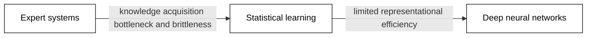
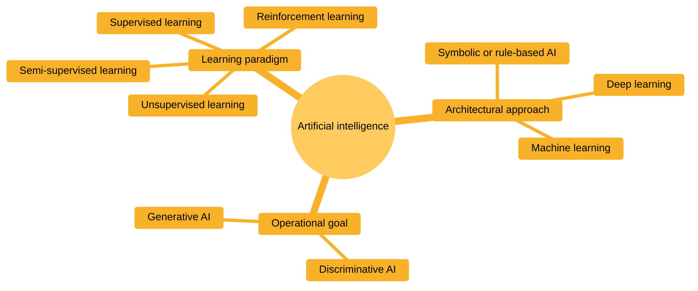
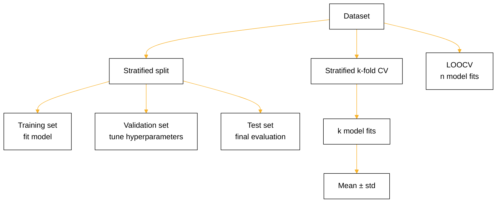
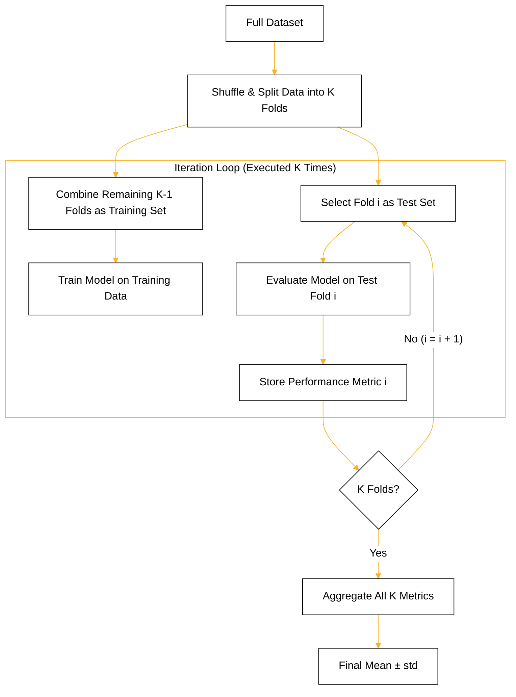
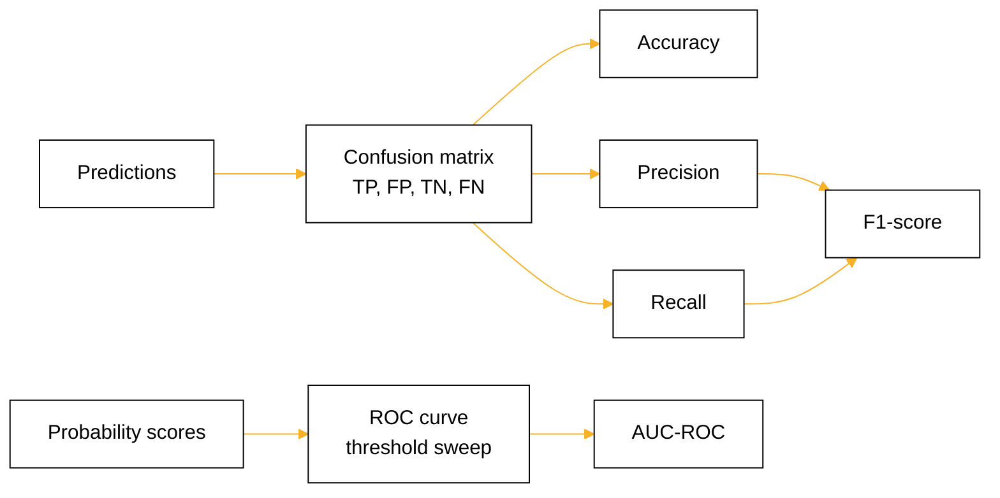

# 02 - Evolution & Architectures of AI

## Abstract

Three generations of AI architecture evolved by addressing specific limitations of their predecessors. Expert systems captured human knowledge in explicit rules but faced bottlenecks in knowledge acquisition and maintenance. Statistical learning shifted the burden from hand-coding rules to fitting models from data, using decision trees and support vector machines to learn decision boundaries. Deep neural networks added depth and representational capacity to escape the limitations of shallow classifiers. This lesson traces this arc, introduces structured methodology for comparing model families across multiple evaluation metrics, and demonstrates why fair empirical comparison requires careful data splitting and metric selection.

## Objectives

- Describe how each AI generation addressed a specific limitation of the previous one.
- Implement a Decision Tree, SVM, and MLP classifier in scikit-learn on the same tabular dataset.
- Evaluate model families using accuracy, precision, recall, F1-score, confusion matrix, and AUC-ROC. Apply stratified k-fold cross-validation to report mean ± std performance. Explain when LOOCV is preferred over k-fold and at what computational cost.

## Content

### Expert Systems

In the 1970s and 1980s, AI researchers built expert systems to encode human expertise as explicit rules. A doctor's diagnosis rule might read: "if fever > 38.5 and throat_pain = yes then suspect pneumonia." These rules lived in a knowledge base, and an inference engine applied them to new cases.

Two chaining modes drove inference. Forward chaining started with known facts and fired rules whose conditions matched, adding new facts until a goal was reached. Backward chaining started with a goal and asked what facts would prove it, working backward through the rule graph. Both approaches let developers reason about rule interactions and debug the system by inspecting individual rules.

Expert systems succeeded on narrow domains with stable rules. They controlled manufacturing systems, diagnosed equipment failures, and advised geologists on mineral exploration. Their rules were transparent: a user could always ask why the system reached a conclusion.

Two severe limitations emerged. First, the knowledge-acquisition bottleneck: extracting all the rules a domain expert knows takes months of interviews and field study. Second, brittleness: if one rule was missing or wrong, the system failed catastrophically on cases where such a rule applied. A pneumonia diagnosis rule worked only if fever was recorded. If the thermometer was broken, the system could not adapt. Maintenance required constant patching, and each patch risked breaking something else.

### Statistical Learning Era

In the 1990s and 2000s, a new paradigm emerged: instead of hand-coding rules, fit models from data. Decision trees and support vector machines dominated this era.

Decision trees partitioned data by splitting on features. Starting with all training data at the root, the algorithm recursively selected the feature and threshold with minimal impurity using metrics like Gini impurity or information gain. Gini impurity measures how mixed the classes are in a subset, while information gain measures how much a split reduced the impurity. Splitting continued until leaves were pure or a stopping criterion was met. After fitting, the tree often overfit to training data, so pruning removed branches failing to improve validation performance.

Trees succeeded because they learned decision boundaries directly from data, scaling to 10,000+ training examples. They required no domain expertise and produced human-readable rules (the splits themselves). On datasets with 5 to 20 features and 10,000+ rows, trees often matched or beat hand-coded expert rules without the knowledge-acquisition bottleneck.

Support vector machines took a different approach: they found the maximum-margin separator between classes. The intuition was simple. Place a line (or hyperplane in higher dimensions) between the two classes with maximum perpendicular distance to the nearest point in each class. In linearly separable cases, this hyperplane was unique and generalized well to unseen data. For nonseparable data, a soft-margin formulation allowed some misclassifications controlled by a parameter C. The kernel trick applied a nonlinear transformation implicitly, mapping data into a high-dimensional space where a linear separator worked. Common kernels were polynomial (mapping to degree-d feature interactions) and RBF (placing Gaussian bumps at each training point). No explicit derivation of the kernels was necessary. The algorithm computed the kernel values and solved the optimization problem.

SVMs excelled at binary classification on datasets with 1,000 to 100,000+ features, especially in text and image classification. They generalized to new data because margin maximization had a theoretical foundation: large margin implied low generalization error.

Both trees and SVMs outperformed expert systems on benchmark datasets because they eliminated the knowledge-acquisition bottleneck and adapted to new data automatically. A model was trained once and deployed. Adding new data required only retraining, not hand-coding new rules.

### Shallow vs. Deep Neural Networks

Neural networks trace back to the 1950s and 1960s, but a limitation blocked their use: shallow networks (one or two hidden layers) could not learn complex functions efficiently. A network with one hidden layer of N units could approximate any continuous function (the universal approximation theorem), but the theorem did not constrain how large N needed to be.

Consider a binary classification task: separate two interleaved circles. A shallow network with two hidden units and one output unit has roughly 9 parameters (weights and biases). A deep network with four hidden layers of two units each has roughly 20 parameters. Both can solve the problem, but depth achieved it with fewer parameters per layer. More generally, depth exponentially reduced the number of parameters needed for the same representational capacity.

The intuition came from compositionality. Deep layers built hierarchies. Early layers detected edges, mid layers combined edges into shapes, and later layers recognized objects. This hierarchy emerged naturally from the data, not from explicit programming. Shallow networks had to represent all hierarchies in a single hidden layer, requiring exponentially more units.

Empirical evidence confirmed depth's advantage. In 2012, ImageNet competitions showed deep convolutional networks (8 layers) trained on GPUs reached 85.2% top-5 accuracy on 1000-class image classification. Shallow networks on the same task achieved less than 75%. The gap widened with larger datasets and more complex tasks. Depth and parallel computation (GPUs) enabled learning from millions of images and billions of parameters.

The trade-off between shallow and deep networks is not accuracy alone but parameter efficiency and learning speed. A shallow network with millions of units can learn anything, but training takes longer and wastes parameters. A deep network uses parameters more efficiently and learns faster because the hierarchy aligns with how real data is structured.

### AI Categorization and Types

#### AI By Architectural Approach

* **Symbolic / Rule-Based AI:** Relies on explicit logic statements, expert rules, and knowledge graphs rather than statistical inference.

* **Machine Learning (ML):** Uses statistical methods to learn patterns from data without explicit hard-coding.

* **Deep Learning (DL):** A subset of ML utilizing deep neural networks to process complex, unstructured data like raw audio, text, and video.

#### AI By Operational Goal: Discriminative vs. Generative

* **Discriminative AI:** Learns decision boundaries between data points to classify inputs or predict outcomes based on conditional probability $P(Y\vert{}X)$. Primary uses in tasks like: **Classification**, **Regression**, **Semantic & Instance Segmentation**, **Named Entity Recognition (NER)**, and **Anomaly & Outlier Detection**

* **Generative AI:** Models the underlying distribution of data $P(X, Y)$ to generate novel content similar to its training set. Examples include Large Language Models (LLMs) for text, Diffusion models for images, and GANs for synthetic data generation.
Primary uses in task like: **Text & Symbolic Generation**, **Image & Visual Synthesis**, **Video & Animation Generation**, **Audio, Voice, & Music Synthesis**, **3D Asset & Spatial Generation**, and **Synthetic Data Generation**

#### AI  By Learning Paradigm: How Models Learn

* **Supervised Learning:** Trains algorithms using fully labeled input-output pairs $(X, Y)$ to learn a mapping function. Key algorithms include Linear Regression, Support Vector Machines (SVMs), and XGBoost.

* **Unsupervised Learning:** Finds intrinsic patterns, groupings, or representations within unlabeled data $X$. Key methods include K-Means clustering, Principal Component Analysis (PCA), and autoencoders.

* **Semi-Supervised Learning:** Leverages a small amount of labeled data alongside a large volume of unlabeled data to improve learning efficiency while lowering annotation costs.

* **Reinforcement Learning (RL):** An agent learns decision-making through trial and error by taking actions within an environment to maximize cumulative reward signals. Examples include Deep Q-Networks, PPO (used in RLHF), and AlphaGo.

### Model Training and Evaluation

#### Data Splitting Strategies

To compare model families fairly, measure them on held-out data the models never saw during training. A standard three-way split divides data into training, validation, and test sets. Training data fits the model. Validation data tunes hyperparameters (e.g., tree depth, SVM kernel, network layer count). Test data, held out until the end, measures final performance on truly unseen examples.

Stratified splitting preserves class proportions in each set. If the original data contains 60% benign cases and 40% malignant cases, stratified splitting ensures each fold maintains this 60/40 ratio. This prevents random chance from skewing a fold to mostly one class, which would make performance metrics unreliable. A fixed random seed (e.g., random_state=42 in scikit-learn) ensures the same split occurs every time the code runs, making results reproducible and comparable across different researchers.

For small datasets or when a single train/test split seems too wasteful, stratified k-fold cross-validation reuses data more efficiently. The data is divided into k equally-sized stratified folds (k=5 is common). The algorithm trains k separate models, leaving out one fold at a time for testing. Fold 1 trains on folds 2-5 and tests on fold 1. Fold 2 trains on folds 1,3,4,5 and tests on fold 2. This pattern continues for all k folds. After all k runs, performance metrics are averaged across folds and reported as mean ± standard deviation. This captures both the central tendency and the variability of performance. Higher variability (larger std) signals performance depends strongly on which fold was held out.

Leave-One-Out Cross-Validation (LOOCV) is an extreme form of k-fold where k equals the dataset size. Each training run uses all examples except one. The single held-out example is the test case. LOOCV computes the performance gap for each example and repeats this n times (where n is the number of examples). The average error across all n iterations is the LOOCV estimate. LOOCV produces the most stable performance estimate because it uses maximum training data per run. However, LOOCV requires n separate training runs. For a dataset of 10,000 examples, this means 10,000 model fits. For computationally expensive models like SVM with large kernels or deep neural networks, LOOCV becomes impractical. LOOCV is most appropriate for small datasets (fewer than 1,000 examples) where the O(n) training cost is acceptable and stability matters more than speed.

#### Evaluation Metrics

**Common Evaluation Metrics for Discriminative and Generative AI**

| Paradigm | Target Modality / Task | Metric Name | Core Measurement Focus |
| --- | --- | --- | --- |
| **Discriminative** | **Classification** | **Accuracy** | Fraction of total correct predictions out of all predictions. |
|  |  | **Precision** | Proportion of predicted positives that are true positives ($\frac{\text{TP}}{\text{TP} + \text{FP}}$). |
|  |  | **Recall (Sensitivity)** | Proportion of actual positives correctly identified ($\frac{\text{TP}}{\text{TP} + \text{FN}}$). |
|  |  | **$F_1$-Score** | Harmonic mean balancing Precision and Recall: $2 \cdot \frac{\text{Precision} \cdot \text{Recall}}{\text{Precision} + \text{Recall}}$. |
|  |  | **ROC-AUC / PR-AUC** | Model ability to distinguish between classes across varying confidence thresholds. |
|  |  | **Log Loss / Cross-Entropy** | Quantifies prediction uncertainty and penalizes confident wrong answers. |
|  | **Regression** | **MAE** (Mean Absolute Error) | Average magnitude of errors in original units ($\vert{}y_i - \hat{y}_i\vert{}$). |
|  |  | **RMSE** (Root Mean Squared Error) | Square root of average squared errors; penalizes large outlier errors heavily. |
|  |  | **$R^2$ Score** | Percentage of target variance explained by the model (1.0 is optimal). |
|  | **Spatial / Vision** | **IoU** (Intersection over Union) | Spatial overlap ratio between predicted bounding box/mask and ground truth. |
|  |  | **mAP** (Mean Average Precision) | Average precision across multiple object categories and detection thresholds. |
|  | **Ranking** | **NDCG** | Quality and relevance of ordered items weighted heavily by top positions. |
| **Generative** | **Text Generation** | **Perplexity (PPL)** | Model uncertainty predicting sequence tokens; lower indicates higher fluency. |
|  |  | **BLEU** | $n$-gram precision overlap against target human references (common in translation). |
|  |  | **ROUGE** | $n$-gram recall overlap against target human references (common in summarization). |
|  |  | **BERTScore** | Semantic similarity using contextual embeddings rather than exact word matches. |
|  | **Code Generation** | **Pass@k** | Probability that at least one of $k$ generated code solutions passes all unit tests. |
|  | **Image & Video** | **FID** (Fréchet Inception Distance) | Statistical distance between real and synthetic feature distributions (lower is better). |
|  |  | **Inception Score (IS)** | Evaluates both image sharpness (quality) and dataset-wide class diversity. |
|  |  | **CLIP Score** | Semantic alignment score between a text prompt and generated visual output. |
|  |  | **LPIPS** | Human-like perceptual distance between real and generated image patches. |
|  | **Audio & Speech** | **FAD** (Fréchet Audio Distance) | Feature distribution distance between real and generated audio recordings. |
|  |  | **PESQ / NISQA** | Speech quality, voice naturalness, and distortion degradation levels. |
|  | **Alignment / Open-End** | **LLM-as-a-Judge** | High-capacity models grading outputs on criteria like reasoning, safety, and helpfulness. |
|  |  | **Elo Rating / Win-Rate** | Pairwise comparative preference ranking from human or model judges (e.g., Chatbot Arena). |

**More on Discriminative (Classification) Metrics**

A single metric (e.g., accuracy) often misleads. On imbalanced datasets where 95% of examples are benign, a trivial model predicting benign for all examples achieves 95% accuracy despite failing completely on the malignant class.

Precision and recall disaggregate performance by class. Precision answers: "Of all the positive predictions my model made, how many were correct?" Formally, precision = true positives / (true positives + false positives). Recall answers: "Of all the actual positive examples, how many did my model find?" Formally, recall = true positives / (true positives + false negatives). A model with high recall catches most positives but might flag negatives as positive (low precision). A model with high precision is conservative, flagging only examples it is confident about, but might miss some positives (low recall). Different applications demand different trade-offs. A medical screening test needs high recall (catch all diseased patients, even at risk of false alarms). A bank fraud detector needs high precision (rarely accuse innocent customers, accepting some missed fraud).

F1-score is the harmonic mean of precision and recall. F1 = 2 * (precision * recall) / (precision + recall). F1 equals 1 when both precision and recall are 1. F1 equals 0 when either is 0. F1 balances the precision-recall trade-off and is useful as a single summary when both classes matter equally.

A confusion matrix displays all four combinations. Rows represent actual classes and columns represent predicted classes. The four cells are: true positives (TP, top-left: positive prediction on positive example), false positives (FP, top-right: positive prediction on negative example), true negatives (TN, bottom-right: negative prediction on negative example), and false negatives (FN, bottom-left: negative prediction on positive example). Reading a confusion matrix reveals which class the model struggles with. Large FN values mean many positives were missed (low recall). Large FP values mean many negatives were flagged as positive (low precision).

Accuracy, Precision, Recall, and F1 all report performance at a fixed decision threshold (usually 0.5 for binary classification). AUC-ROC (Area Under the Receiver Operating Characteristic curve) captures threshold-free discriminability. A binary classifier outputs a probability score (e.g., 0.8 for positive, 0.2 for negative) for each example. The ROC curve sweeps the decision threshold from 0 to 1, plotting the true positive rate (recall) on the y-axis and false positive rate on the x-axis. At threshold 0, all examples are classified positive (TP and FP are maximized). At threshold 1, all are classified negative (TP and FP are zero). As the threshold moves, the curve traces a path from (0,0) to (1,1). A diagonal line from (0,0) to (1,1) represents random guessing. An ideal classifier hugs the top-left corner, reaching (0,1) before sweeping to (1,1). The area under this curve ranges from 0.5 (random) to 1.0 (perfect). AUC-ROC is a single scalar summary independent of the choice of threshold.

Training wall-clock time (measured with time.time() in Python or equivalent) records how long model fitting took. Faster training enables quicker iteration during development and faster retraining as new data arrives. Slow models may sacrifice speed for higher accuracy or more expressive capacity.

## Summary

AI evolved through three generations, each addressing limitations of its predecessor. Expert systems ruled the early era but faced knowledge-acquisition bottlenecks and brittleness. Statistical learning shifted to data-driven models: decision trees and SVMs learned boundaries from data without hand-coded rules and outperformed expert systems on benchmarks. Deep neural networks added structural depth and parameter efficiency, scaling to complex tasks and large datasets. Fair empirical comparison requires stratified data splitting to ensure reproducibility, stratified k-fold cross-validation to stabilize performance estimates, and a suite of metrics (accuracy, precision, recall, F1-score, confusion matrix, AUC-ROC) revealing performance across class-wise trade-offs and decision thresholds. Training time completes the picture, informing deployment and iteration speed.

## Useful References and Resources

- Quinlan, J. R. (1986). "Induction of Decision Trees." Machine Learning, 1(1):81-106. Foundational paper on decision tree splitting and pruning.
- Cortes, C. and Vapnik, V. (1995). "Support-Vector Networks." Machine Learning, 20(3):273-297. Original SVM formulation and margin-maximization intuition.
- Cybenko, G. (1989). "Approximation by Superpositions of a Sigmoidal Function." Mathematics of Control, Signals and Systems, 2(4):303-314. Proof of the universal approximation theorem for single-hidden-layer networks.
- Krizhevsky, A., Sutskever, I., and Hinton, G. E. (2012). "ImageNet Classification with Deep Convolutional Neural Networks." Advances in Neural Information Processing Systems (NeurIPS). Empirical evidence of depth's advantage on large-scale image classification.
- Fawcett, T. (2006). "An Introduction to ROC Analysis." Pattern Recognition Letters, 27(8):861-874. Guide to ROC curves, AUC-ROC, and threshold-free performance evaluation.
- Scikit-learn documentation: Decision Tree Classifier, Support Vector Machines, Multi-layer Perceptron, metrics (accuracy, precision, recall, f1, confusion_matrix, roc_auc_score), model_selection.StratifiedKFold. Practical implementation and parameter reference.
