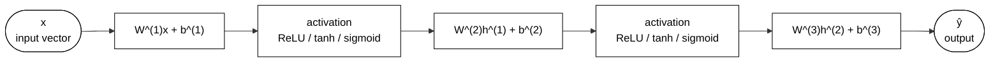
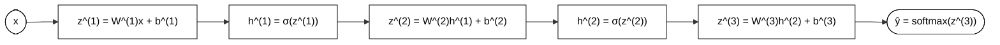
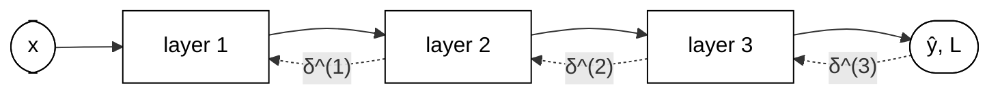
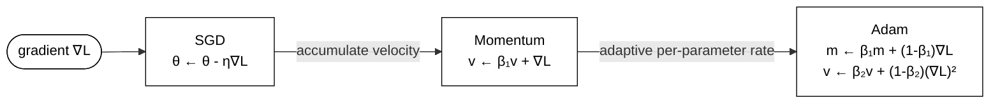

# 03 — Deep Learning Fundamentals

## Abstract
This lesson covers the core mechanics behind neural networks. Students learn how fully-connected layers build features, how forward propagation carries activations through a network, how loss functions turn predictions into error signals, and how backpropagation updates weights.

## Objectives
- Trace forward and backward passes through a two-hidden-layer network by hand, writing out the matrix multiplications and chain-rule gradient expressions at each layer.
- Implement a multi-layer perceptron from scratch in PyTorch using only tensor operations and state why each activation function and initializer was chosen.
- Select an appropriate loss function for a given task and derive its gradient with respect to the output logits.
- Train the from-scratch MLP to >97% test accuracy on MNIST and explain how each optimizer hyperparameter affects convergence.

## Content
### Neural network architecture components
A fully-connected layer applies an affine transform to an input vector. For input $x$ and parameters $W$ and $b$, the layer computes $z = Wx + b$ and then passes $z$ through a nonlinear activation. This arrangement lets a network model curved decision boundaries instead of a single linear separator.

The activation function shapes the signal along each layer. ReLU keeps positive values and sets negative values to zero. This choice preserves strong gradients for positive inputs and gives sparse activations. Sigmoid compresses values into (0, 1) and is useful when outputs represent probabilities, yet its gradients shrink sharply away from zero. Tanh centers activations near zero and often behaves better than sigmoid in hidden layers because it preserves sign information.

Initialization matters because unstable variance can destroy useful gradients early in training. A random normal draw with no scaling can make activations too small or too large as depth grows. Xavier initialization keeps variance stable for sigmoid and tanh by scaling weights with the input dimension. Kaiming initialization scales weights for ReLU by accounting for the fact that half of activations are zeroed. These choices keep forward and backward signals in a workable range as depth increases.

### Forward propagation
Forward propagation builds the prediction in a sequence of matrix multiplies and nonlinear transforms. For a three-layer network, the hidden states follow

$$
h^{(1)} = \sigma(W^{(1)}x + b^{(1)}) \\
h^{(2)} = \sigma(W^{(2)}h^{(1)} + b^{(2)}) \\
\hat{y} = \text{softmax}(W^{(3)}h^{(2)} + b^{(3)})
$$

The input $x$ enters the first layer, each layer creates a new representation, and the final output produces a probability distribution over classes. A computation graph records each intermediate value, so the network can later trace which parent values contributed to each loss value.

This graph is more than a diagram. This graph is the exact path along which gradients later flow. Each matrix multiply creates a tensor operation, each activation creates a nonlinear transformation, and each layer output becomes the next layer input. When a student writes a multi-layer perceptron from scratch, the forward pass mirrors this graph one tensor operation at a time.

### Loss functions
A loss function turns model predictions into a scalar error signal. For classification, cross-entropy loss measures the mismatch between the target distribution and the predicted class probabilities. With target $y$ and prediction $\hat{y}$, the standard form is

$$
L = -\sum_k y_k \log(\hat{y}_k)
$$

Cross-entropy works well with softmax outputs because it penalizes confident errors strongly. The gradient with respect to the logits simplifies to $\hat{y} - y$. This simple form drives the learning signal and makes gradient updates stable in multiclass classification.

For regression, mean squared error measures the average squared gap between the target value and the prediction. The form is

$$
L = \frac{1}{n} \|y - \hat{y}\|^2
$$

The gradient with respect to the prediction is proportional to the residual $y - \hat{y}$. The choice between cross-entropy and MSE depends on the task. Classification uses cross-entropy for discrete labels. Regression uses MSE when the target is continuous and the output is real-valued.

### Backpropagation
Backpropagation applies the chain rule across the full computation graph. Each parameter receives a gradient equal to the derivative of the final loss with respect to the parameter. For a layer $l$, the weight gradient follows

$$
\frac{\partial L}{\partial W^{(l)}} = \delta^{(l)} (h^{(l-1)})^T
$$

where $\delta^{(l)}$ carries the gradient signal from the next layer back through the current layer. The same pattern repeats for every layer, so the algorithm propagates error information from the output back toward the input.

This backward pass explains why deep networks can fail. Vanishing gradients occur when repeated multiplications drive gradients toward zero, especially with sigmoid and tanh in deep stacks. ReLU helps because its derivative is 1 for positive inputs, which reduces shrinkage. Exploding gradients occur when gradients grow rapidly in magnitude, and gradient clipping reduces the step size of large gradients and keeps updates stable.

The core idea remains simple. The network computes a loss, runs the chain rule across each layer, and uses the resulting gradients to adjust weights. Without this gradient flow, a deep model would not learn from data.

### Gradient-descent optimizers
The simplest optimizer uses vanilla SGD. Each update shifts parameters in the direction opposite to the gradient,

$$
\theta \leftarrow \theta - \eta \nabla L
$$

The learning rate $\eta$ controls the step size. A small value leads to slow progress, while a large value can overshoot a low-loss region.

Momentum improves SGD by carrying forward a running average of past gradients. This helps the optimizer move through shallow valleys and reduces oscillation along narrow directions. Adam builds on this idea by maintaining first- and second-moment estimates of the gradients. The first moment tracks the mean gradient, while the second moment tracks the variance of the gradient. This gives adaptive learning rates across parameters and often improves convergence speed.

The practical default for many deep-learning tasks is Adam with a learning rate of $1\text{e-}3$. The optimizer hyperparameters matter. The learning rate sets the step size, $\beta_1$ controls how much past gradients influence the current direction, $\beta_2$ controls the scale of the second-moment estimate, and $\epsilon$ prevents division by zero in the adaptive update. These values shape how quickly a model moves to a low-loss region and how stable that motion remains.

## Summary
This lesson covered the core building blocks of deep learning. Students traced forward passes through a fully-connected network, selected loss functions for classification and regression, and followed the chain-rule signal through backpropagation. The final section showed how SGD, momentum, and Adam update parameters and why optimizer choice changes convergence behavior.

## Useful References and Resources
- Goodfellow, I., Bengio, Y., and Courville, A. Deep Learning. Chapters on feedforward networks, activation functions, and backpropagation.
- PyTorch documentation for autograd, nn.Parameter, and raw tensor operations.
- LeCun, Y., Bottou, L., Bengio, Y., and Haffner, P. Gradient-Based Learning Applied to Document Recognition. The MNIST benchmark and early deep learning training setup.
